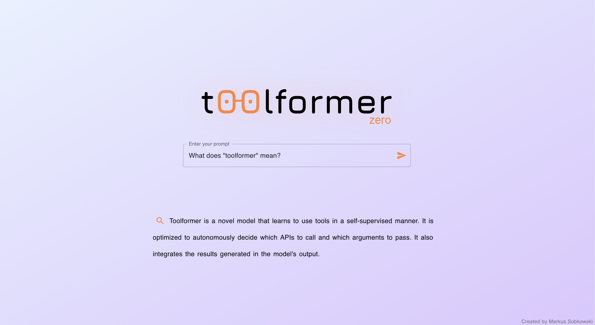

# Toolformer Zero

React app implementing OpenAI and Google APIs to re-create behavior of the [toolformer](https://arxiv.org/abs/2302.04761) paper.

It does so using zero/few-shot prompting. No model-finetuning is needed, instead the entire "training" of the model is happening via prompt engineering.

**You can find a deployed version of this project on [toolformerzero.com](https://toolformerzero.com).**

Hosted via GitHub Pages.

### Run the project yourself

- Clone this repository
- Run `npm install`
- Run `npm start`
